# UPI Payments & Fraud Analytics

An end-to-end analytics project that uses SQL, Python, and Power BI to analyze UPI transaction performance, fraud patterns, and risk scores.

## Business Problem
UPI processes a very large volume of digital payments, and even a small fraud rate creates financial and trust risk. This project tracks transaction health, finds where and when fraud concentrates, and helps investigators prioritize high-risk transactions.

## Objectives
- Track transaction volume, value, and success rate
- Identify fraud by city, bank, fraud type, and time of day
- Analyze risk score distribution to support investigation priorities

## Dataset
- **File:** `data/upi_transactions.csv`
- **Size:** about 20,000 transactions in 2025
- **Key fields:** transaction ID, date, amount, bank, city, channel, device, status, fraud flag, fraud type, risk score

## Key Metrics
| Metric | Value |
|---|---|
| Transactions | 20K |
| Total Value | $22.06M |
| Success Rate | 92.26% |
| Fraud Cases | 712 |
| Fraud Value | $738.71K |
| Fraud Rate (calculated) | about 3.6% of transactions, 3.3% of value |

## Dashboards
### Executive View
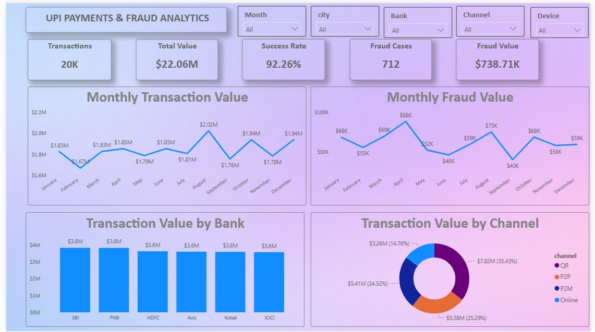

### Fraud Analytics
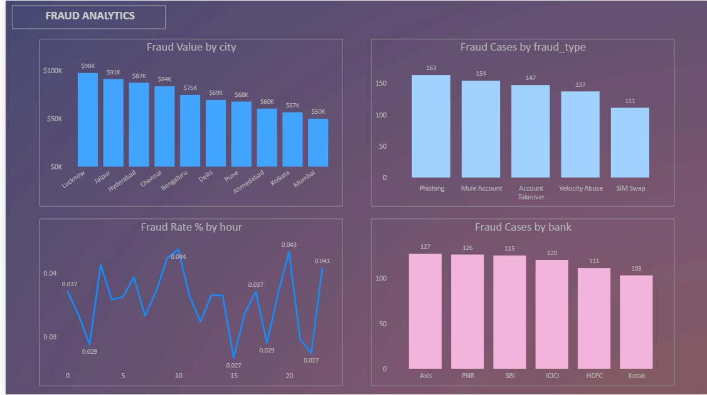

### Operations & Risk
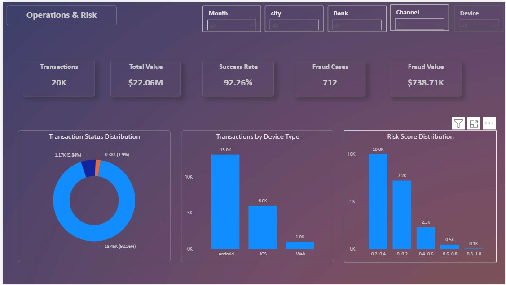

### Investigation Table
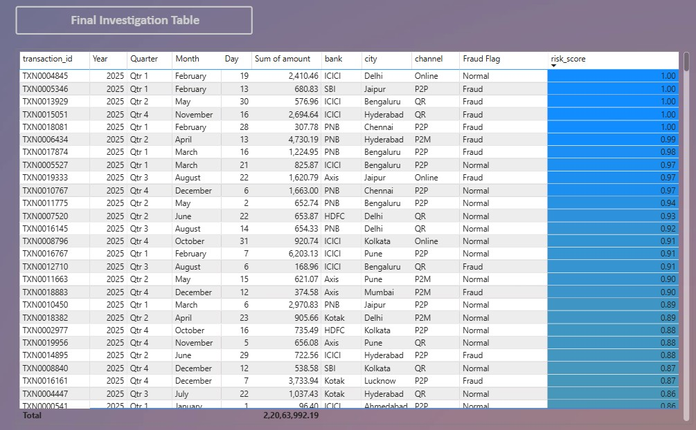

## Key Insights
1. **Fraud is spread across cities, but a few lead.** Lucknow ($98K), Jaipur ($91K), and Hyderabad ($87K) are the top three, about 37% of total fraud value (calculated). Mumbai is lowest at $50K.
2. **Phishing and mule accounts are the biggest fraud types.** Phishing (163) and Mule Account (154) make up about 45% of the 712 fraud cases (calculated). SIM Swap is lowest at 111.
3. **Fraud rate changes by hour.** The hourly fraud rate ranges from about 2.7% to 4.4%, with peaks near hours 10 and 20 and dips near hours 15 and 22.
4. **Most transactions are low risk.** About 86% of transactions score below 0.4, and only about 3% score above 0.6 (calculated from the risk score chart).
5. **Risk score alone doesn't separate fraud.** In the top-ranked investigation rows, several transactions with scores of 0.86 to 0.97 are flagged as Normal, so the scoring threshold deserves review.
6. **Fraud value peaks in April and August.** Monthly fraud value reaches $88K in April and $75K in August, and is lowest in September ($40K).

## Recommendations
- Add extra monitoring for the highest fraud-value cities
- Prioritize phishing and mule-account detection rules
- Review the risk-score threshold, since high-scoring transactions are sometimes flagged Normal
- Compare fraud rate by channel (QR, P2P, P2M, Online) to find the riskiest channel

## Charts
<table>
  <tr>
    <td>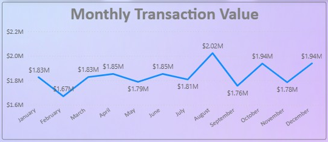</td>
    <td>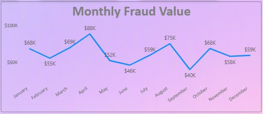</td>
  </tr>
  <tr>
    <td>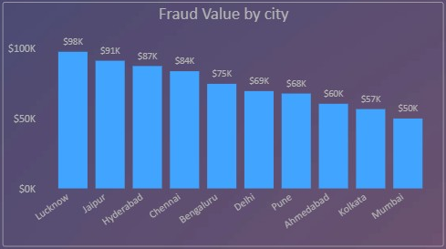</td>
    <td>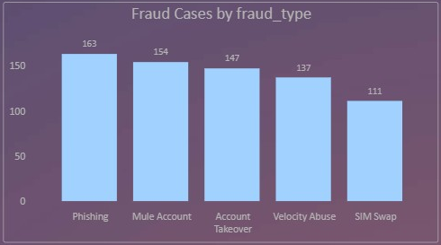</td>
  </tr>
  <tr>
    <td>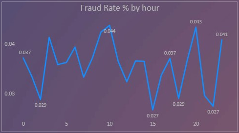</td>
    <td>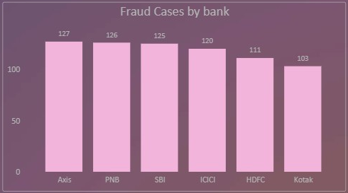</td>
  </tr>
  <tr>
    <td>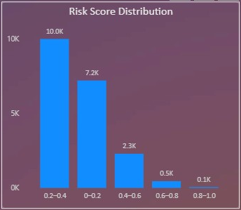</td>
    <td>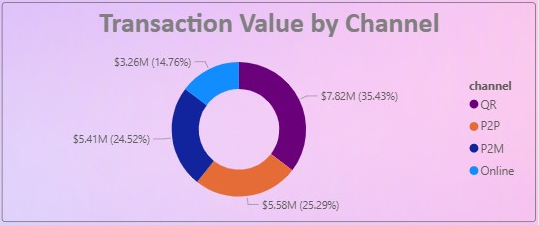</td>
  </tr>
</table>

## Tools Used
SQL (MySQL) • Python (Pandas, Matplotlib) • Power BI • DAX

## Repository Structure

├── data/          # Transaction dataset
├── sql/           # 10 analysis queries
├── python/        # Data analysis notebook
├── powerbi/       # Power BI dashboard file
├── screenshots/   # Dashboard and chart images
└── README.md

## How to Use
1. Run `sql/01_schema.sql`, then import `data/upi_transactions.csv`
2. Run the remaining SQL files in order
3. Open `powerbi/upi_fraud_dashboard.pbix` in Power BI Desktop

## Author
**Prashanth Udidi**
Data Analytics | SQL | Python | Power BI | Excel
[LinkedIn](https://www.linkedin.com/in/your-profile) • [GitHub](https://github.com/udidiprashanth-alt)
